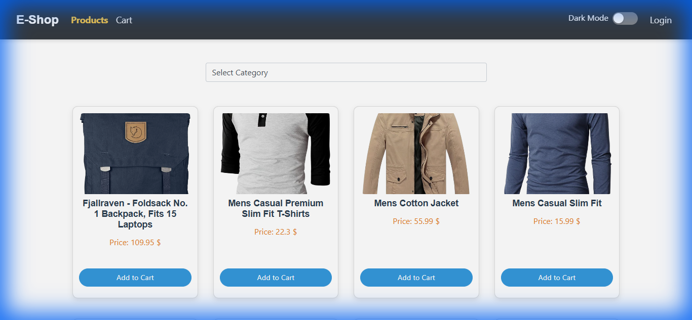

# 🛒 EShop - Complete E-Commerce Application

[](https://angular.io/)
[](https://www.typescriptlang.org/)
[](https://getbootstrap.com/)
[](LICENSE)
[](https://abanoub-magdi.github.io/Complete_E-Shop/)

A modern, full-featured e-commerce web application built with Angular 18. This application provides a complete shopping experience with product browsing, cart management, admin panel, and user authentication.

## 🌐 Live Demo

**View the live application:** [https://abanoub-magdi.github.io/Complete_E-Shop/](https://abanoub-magdi.github.io/Complete_E-Shop/)



## ✨ Features

- 🛍️ **Product Catalog** - Browse products with category filtering
- 🔍 **Product Details** - View detailed information about each product
- 🛒 **Shopping Cart** - Add products to cart and manage items
- 👤 **User Authentication** - Login system with role-based access
- 🔐 **Admin Panel** - Manage products (add, delete, filter)
- 🎨 **Modern UI** - Built with Bootstrap 5 and Angular Material
- 📱 **Responsive Design** - Works seamlessly on all devices
- ⚡ **Fast Performance** - Optimized with lazy loading
- 🔄 **Auto Deployment** - CI/CD with GitHub Actions
- 🔒 **Route Guards** - Protected admin routes with authentication

## 🛠️ Technologies Used

- **Frontend Framework:** Angular 18.2.0
- **UI Libraries:** 
  - Bootstrap 5.3.3
  - Angular Material 18.2.12
- **Language:** TypeScript 5.5.2
- **State Management:** RxJS 7.8.0
- **HTTP Client:** Angular HttpClient with Interceptors
- **API:** FakeStoreAPI (https://fakestoreapi.com/)
- **Deployment:** GitHub Pages with GitHub Actions
- **Build Tool:** Angular CLI 18.2.3

## 📋 Prerequisites

Before you begin, ensure you have the following installed:

- **Node.js** (version 18 or higher) - [Download](https://nodejs.org/)
- **npm** (comes with Node.js) or **yarn**
- **Angular CLI** (install globally: `npm install -g @angular/cli`)

### Verify Installation

```bash
node --version  # Should be v18.x.x or higher
npm --version   # Should be 9.x.x or higher
ng version      # Should be 18.x.x or higher
```

## 🚀 Getting Started

### Installation

1. **Clone the repository**
   ```bash
   git clone https://github.com/Abanoub-Magdi/Complete_E-Shop.git
   cd Complete_E-Shop
   ```

2. **Install dependencies**
   ```bash
   npm install
   ```

### Development Server

Run the development server:

```bash
npm start
# or
ng serve
```

Navigate to `http://localhost:4200/`. The application will automatically reload if you change any of the source files.

The app will automatically reload if you change any of the source files.

### Build

Build the project for production:

```bash
# Development build
npm run build

# Production build (for GitHub Pages)
npm run build:prod
```

The build artifacts will be stored in the `dist/e-shop/browser/` directory.

## 📁 Project Structure

```
src/
├── app/
│   ├── admin/              # Admin panel components
│   │   └── components/
│   │       └── admin/      # Admin dashboard
│   ├── carts/              # Shopping cart module
│   │   ├── components/
│   │   │   └── cart/       # Cart component
│   │   └── services/       # Cart service
│   ├── Interceptors/       # HTTP interceptors
│   │   ├── auth.interceptor.ts
│   │   └── auth.service.ts
│   ├── login/              # Login component
│   ├── products/           # Products module
│   │   ├── components/
│   │   │   ├── all-products/      # Product listing
│   │   │   └── products-details/  # Product details page
│   │   ├── lazy-products/  # Lazy loaded products module
│   │   ├── module/         # Product model/interface
│   │   └── services/       # Products service
│   └── shared/             # Shared components and services
│       ├── components/
│       │   ├── footer/     # Footer component
│       │   ├── header/     # Header/Navigation component
│       │   ├── spinner/    # Loading spinner
│       │   ├── product/    # Product card component
│       │   └── select/     # Select dropdown component
│       └── services/
│           ├── admin.guard.ts    # Route guard for admin
│           ├── auth.service.ts   # Authentication service
│           └── shared.service.ts # Shared utilities
├── environments/           # Environment configuration
│   ├── environment.ts      # Development config
│   └── environment.prod.ts # Production config
└── styles.scss             # Global styles
```

## 🗺️ Application Routes

The application uses Angular Router with the following routes:

- `/products` - Product listing page (default route)
- `/details/:id` - Product details page
- `/cart` - Shopping cart page
- `/login` - User login page
- `/admin` - Admin panel (protected route, requires authentication)
- `/**` - Redirects to `/products` (catch-all route)

## 🔧 Configuration

### Environment Variables

The application uses environment files for configuration:

- **Development:** `src/environments/environment.ts`
- **Production:** `src/environments/environment.prod.ts`

Current API configuration:
```typescript
apiUrl: 'https://fakestoreapi.com/'
```

### Customizing API Endpoint

To use a different API, update the `apiUrl` in the environment files:

```typescript
export const environment = {
  production: false,
  apiUrl: 'https://your-api-url.com/'
};
```

## 🚀 Deployment

This project uses **GitHub Actions** for automatic deployment to GitHub Pages.

### Automatic Deployment

- The deployment workflow runs automatically on every push to the `main` branch
- The workflow builds the Angular app and deploys it to GitHub Pages
- A `404.html` file is automatically created to handle client-side routing

### Manual Deployment

1. Build for production:
   ```bash
   npm run build:prod
   ```

2. The built files are in `dist/e-shop/browser/`

3. Deploy to your hosting service

### Enable GitHub Pages

1. Go to your repository **Settings**
2. Navigate to **Pages** section
3. Under **Source**, select **GitHub Actions**
4. Save the changes

## 🧪 Testing

Run unit tests:

```bash
npm test
# or
ng test
```

Run tests with coverage:

```bash
ng test --code-coverage
```

## 📝 Available Scripts

- `npm start` - Start development server on `http://localhost:4200`
- `npm run build` - Build for development
- `npm run build:prod` - Build for production (GitHub Pages)
- `npm run watch` - Build and watch for changes
- `npm test` - Run unit tests
- `ng generate component component-name` - Generate a new component
- `ng generate service service-name` - Generate a new service

## 🔐 Authentication & Authorization

### Login System

- **Login Route:** `/login`
- **Authentication:** Uses HTTP interceptors for token management
- **Session Management:** Handled via Angular services

### Admin Access

- **Admin Route:** `/admin` (protected)
- **Route Guard:** `AdminGuard` protects admin routes
- **Access Control:** Only authenticated admin users can access

### Security Features

- HTTP interceptors for request/response handling
- Route guards for protected routes
- Token-based authentication

## 🛒 Features in Detail

### Product Management

- ✅ View all products with pagination
- ✅ Filter products by category
- ✅ Search functionality
- ✅ View detailed product information
- ✅ Add products to shopping cart
- ✅ Responsive product cards

### Shopping Cart

- ✅ Add items to cart
- ✅ Remove items from cart
- ✅ Update item quantities
- ✅ View cart total
- ✅ Submit cart to server
- ✅ Persistent cart state

### Admin Panel

- ✅ Add new products
- ✅ Delete existing products
- ✅ Filter products by category
- ✅ Manage product inventory
- ✅ Protected admin routes
- ✅ Admin-only access control

## 🐛 Troubleshooting

### Common Issues

**Issue: `ng: command not found`**
- Solution: Install Angular CLI globally: `npm install -g @angular/cli`

**Issue: Port 4200 already in use**
- Solution: Use a different port: `ng serve --port 4300`

**Issue: Build fails with memory errors**
- Solution: Increase Node.js memory: `node --max-old-space-size=4096 node_modules/@angular/cli/bin/ng build`

**Issue: GitHub Pages shows 404 for routes**
- Solution: Ensure `404.html` is configured and base-href is set correctly in `build:prod` script

**Issue: API requests failing**
- Solution: Check CORS settings and verify API endpoint is accessible

## 🤝 Contributing

Contributions are welcome! Please feel free to submit a Pull Request.

### Contribution Guidelines

1. Fork the repository
2. Create your feature branch (`git checkout -b feature/AmazingFeature`)
3. Commit your changes (`git commit -m 'Add some AmazingFeature'`)
4. Push to the branch (`git push origin feature/AmazingFeature`)
5. Open a Pull Request

## 📄 License

This project is open source and available under the [MIT License](LICENSE).

## 👤 Author

**Abanoub Magdi**

- GitHub: [@Abanoub-Magdi](https://github.com/Abanoub-Magdi)
- Repository: [Complete_E-Shop](https://github.com/Abanoub-Magdi/Complete_E-Shop)

## 🙏 Acknowledgments

- [FakeStoreAPI](https://fakestoreapi.com/) for providing the test API
- [Angular](https://angular.io/) team for the amazing framework
- [Bootstrap](https://getbootstrap.com/) for the UI components
- [Angular Material](https://material.angular.io/) for Material Design components

## 📊 Project Status

✅ **Active Development** - The project is actively maintained and updated.

---

⭐ **If you like this project, please give it a star on GitHub!**

📧 **Questions or suggestions?** Feel free to open an issue or submit a pull request.
